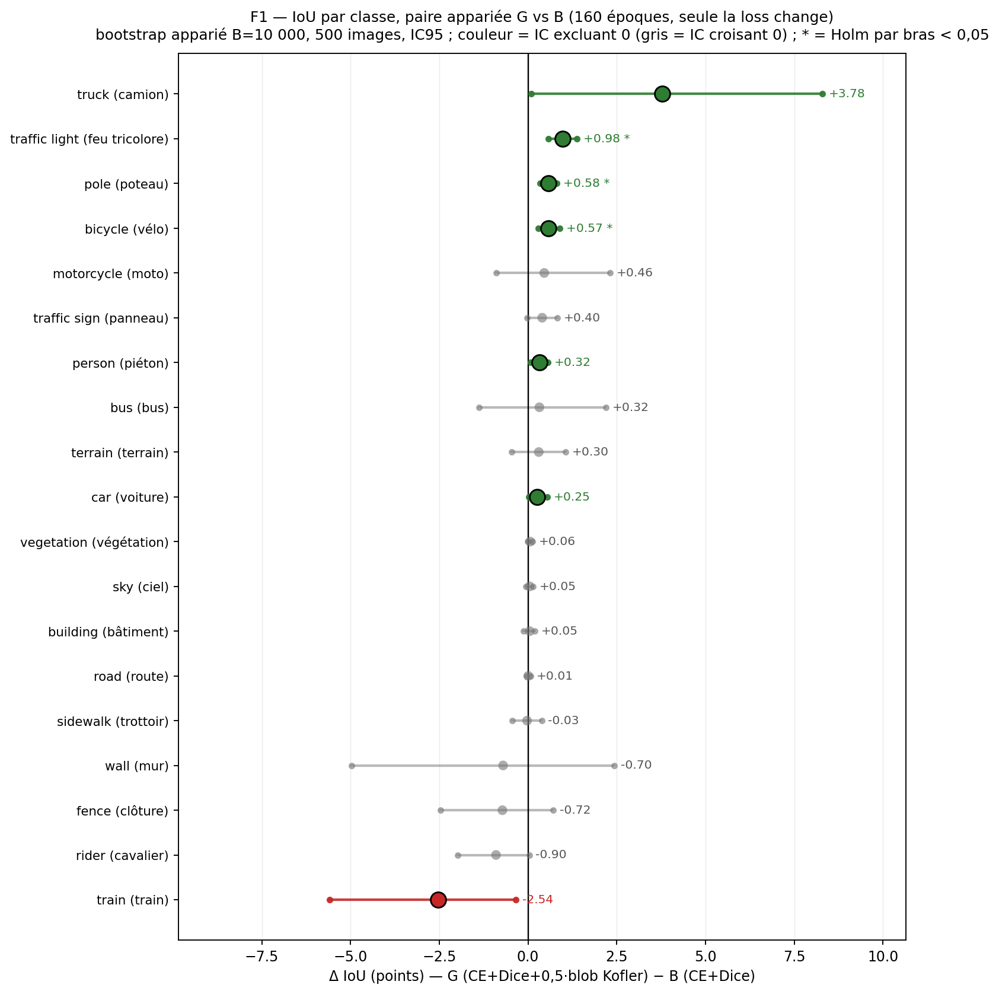
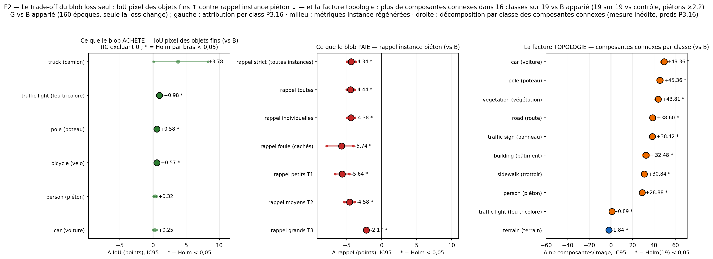
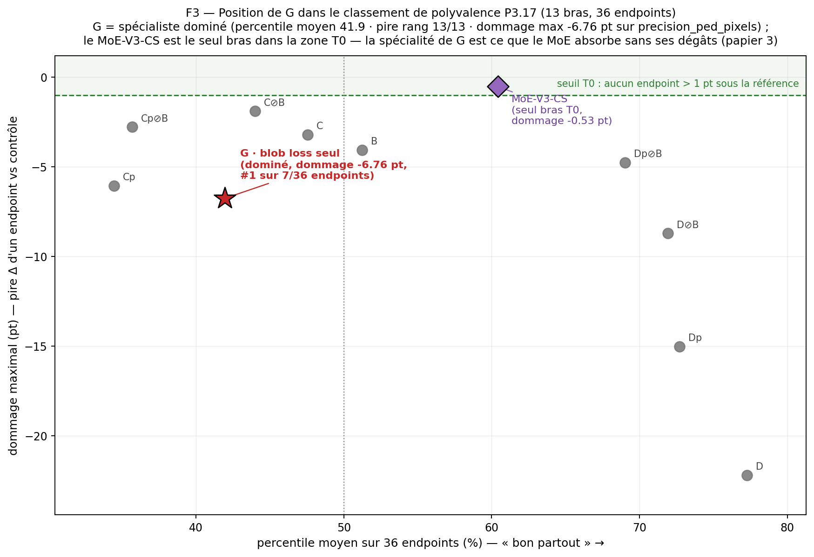

---
header-includes:
  - \usepackage{float}
  - \floatplacement{figure}{H}
  - \usepackage{booktabs}
---

# Le poids égal par instance ne paie pas seul : un auxiliaire blob loss en pleine résolution Cityscapes achète l'IoU des objets fins avec le rappel piéton, et ne paie que comme expert d'un mélange d'experts

*Cityscapes val · ConvNeXt-V2-Base + UPerNet · CE + Dice + 0,5·blob (Kofler, IPMI 2023) vs CE + Dice · 3 seeds × 160 époques à 1024×2048*

---

## Résumé

On rapporte une évaluation **pré-enregistrée** et contrôlée de la **blob loss** de Kofler *et al.* [IPMI 2023] — un terme auxiliaire qui donne à chaque instance GT le même poids quel que soit son nombre de pixels — portée en **segmentation sémantique multi-classe exclusive à la résolution native Cityscapes** (1024×2048, 19 classes, régime softmax). Le bras **G** (CE + Dice + 0,5·blob) est comparé à sa référence appariée exacte **B** (CE + Dice) : même architecture ConvNeXt-V2-Base + UPerNet, même recette 160 époques, même distribution d'augmentation, trois seeds partagés (42, 123, 456) — **seule la loss change**.

L'**endpoint primaire pré-enregistré est nul** : mIoU officielle dataset-level sur le holdout partagé de 500 images, Δ(G−B) = **+0,170 pt**, IC95 [−0,233 ; +0,551], p bilatéral du bootstrap apparié par image = **0,4032** (B = 10 000 réplicats). Le poids égal par instance **n'améliore pas** la mIoU globale dans ce régime. Ce que le terme fait réellement est un **trade-off mesuré**. Il *achète* la couverture pixel des objets fins — traffic light +0,98, pole +0,58, bicycle +0,57 IoU vs B (Holm-significatifs dans la famille 19 classes), truck +3,78 (IC excluant 0), Boundary F1 (3 px) +0,63 — et le *paie* en intégrité des instances piétonnes : rappel strict **−4,34**, strate des petites instances (T1) **−5,65**, groupes-foule **−5,74**, précision pixel piéton **−2,70** (tous vs B apparié, Holm = 0), et une **fragmentation** générale des masques : les composantes connexes passent de 615,1 à 933,9 par image (**×1,52**), en hausse dans **16 classes sur 19** contre le bras B apparié (14 hausses Holm-significatives ; la seule baisse matérielle est terrain, −1,8) et dans **19 sur 19** contre le bras contrôle (masques piétons ×2,2) — une décomposition par classe inédite qui *révise* l'hypothèse mécaniste de travail du programme (le terme ne supprime pas les petites composantes ; il crée des trous). Sur le critère de polyvalence pré-enregistré du programme (36 endpoints × 13 bras), G est un **spécialiste dominé** : percentile moyen 41,9, pire rang 13/13, dommage maximal −6,76 pt, 13 pertes significatives contre 4 gains.

Le même verdict tient sur un deuxième dataset et un deuxième régime de probabilités : sur BRATS 2023 (sigmoid region-based, MedNeXt, recette nnU-Net, CV 5 folds, n = 1 196), le bras blob seul score **−0,00376 Dice** vs baseline, mais comme **expert 3 du MoE-V3 gagnant** il contribue **+0,00566 Dice, 1^er^ des 29 bras** [DOI 10.5281/zenodo.22903668]. Le mélange compagnon Cityscapes **MoE-V3-CS** (quatre experts initialisés depuis B, D, Dp, G ; gate top-2 par patch) raconte la même histoire : il absorbe la spécialité objets fins de G — rappel petites instances T1 +0,80 (significatif), traffic light non dégradé — sans hériter de ses dégâts (dommage maximal −0,53 pt ; ΔmIoU +0,45 pt, p = 0,0066 vs son contrôle apparié).

**Contributions.** (1) Un **primaire nul pré-enregistré** pour un auxiliaire à poids-égal-par-instance en segmentation exclusive pleine résolution, rapporté comme tel. (2) Un **diagnostic de trade-off complet** : IoU par classe, sept familles de métriques métier sur les instances piétonnes, et une **décomposition par classe inédite des composantes connexes** (933,9 vs 615,1 composantes/image) qui contredit le mécanisme de compaction initialement supposé — le papier rapporte ce que les tables montrent. (3) Un **portage exact** de l'algèbre de Kofler (eq. 1) au régime softmax exclusif avec paquetages d'instances pré-calculés : +1 à 2 % de temps par époque contre +870 s/époque pour le chemin naïf, parité naïf↔pré-calculé verrouillée par tests unitaires, piège d'alignement du flip horizontal documenté. (4) La preuve, sur deux datasets et deux régimes de probabilités, que le terme **paie comme expert initialisé d'un mélange** alors qu'il est nul-ou-négatif seul. (5) Publication du code, des configs, des tables, des figures et des scripts de régénération.

---

## 1. Introduction

Les losses voxel-wise — cross-entropy, Dice — pondèrent chaque instance GT par son volume. Les petites instances (classes rares, objets lointains ou partiellement occlus) contribuent peu de pixels à la loss et sont, au sens strict de l'optimisation, *rationnellement sacrifiées*. Kofler *et al.* [2023] proposent la **blob loss** : un terme auxiliaire qui calcule un soft dice binaire **par instance GT**, sur un domaine restreint à cette instance plus tous les pixels hors des autres instances de la même classe, moyenné instances → classe → image → batch. Chaque instance porte alors le même poids total quel que soit son nombre de pixels. Le terme a été validé en segmentation biomédicale sous la recette **region-based** nnU-Net (cibles WT/TC/ET chevauchantes, canaux sigmoid), où il améliore les métriques de petites structures.

Ce papier pose la question du transfert de l'autre côté de la clôture :

> Le poids égal par instance paie-t-il en segmentation sémantique **multi-classe exclusive** — softmax sur 19 classes plates — à la **résolution native Cityscapes**, sous budget d'entraînement fixe et endpoint primaire pré-enregistré ?

Le cadre est un bras contrôlé d'un programme de quatre papiers sur les losses, sur Cityscapes à 1024×2048 avec ConvNeXt-V2-Base + UPerNet : une étude de régression auxiliaire par carte de distance [Cassez 2026a, DOI 10.5281/zenodo.21006236], une ablation de boundary loss dont le bras B (CE + Dice, 160 époques, seeds 42/123/456) est la référence appariée exacte utilisée ici [Cassez 2026b, DOI 10.5281/zenodo.21006393], cette étude blob loss, et un rapport compagnon sur un mélange d'experts (MoE-V3-CS) dans lequel le présent bras G sert d'expert 3. Le programme est le miroir d'un volet BRATS achevé [DOI 10.5281/zenodo.22903668 ; 10.5281/zenodo.22906447 ; 10.5281/zenodo.22904810 ; 10.5281/zenodo.20110976], si bien que chaque bras blob existe sur les deux datasets sous deux régimes de probabilités.

La réponse, mesurée avant la rédaction de ce manuscrit et pré-enregistrée dans la chaîne d'artefacts du programme, est **non — le primaire est nul** (Δ mIoU +0,170 pt, p = 0,4032). C'est donc un papier à résultat négatif, dans la discipline maison du programme : les résultats négatifs et neutres sont rapportés comme tels, toutes les métriques officielles sont montrées, et la contribution est le **diagnostic** (ce que le terme achète, ce qu'il casse, et le mécanisme que les tables soutiennent réellement), le **portage exact** (algèbre, coût, pièges) et l'**usage** (expert initialisé d'un mélange, mesuré sur deux datasets).

---

## 2. Travaux connexes

**Déséquilibre de classes en segmentation sémantique.** La cross-entropy re-pondérée par classe est le remède standard ; nous utilisons des poids ISNS (inverse de la racine carrée du nombre d'échantillons) dans les **deux** bras, donc la comparaison isole le terme blob par-dessus un CE déjà re-pondéré. La loss Dice [Milletari 2016] optimise le recouvrement régional et est équilibrée au niveau de la *classe*, pas de l'*instance* : au sein d'une classe, une grande instance domine toujours plusieurs petites. La loss focale [Lin 2017] re-pondère les pixels difficiles, là encore pixel à pixel. La blob loss est le remède au déséquilibre qui opère **par instance**.

**Blob loss.** Kofler *et al.* [2023, IPMI ; arXiv:2205.08209] introduisent le terme pour la segmentation biomédicale sous la recette region-based nnU-Net [Isensee 2021], avec la loss totale $\mathcal{L} = \mathcal{L}_{seg} + \beta\,\mathcal{L}_{blob}$ et le ratio du papier $\alpha:\beta = 2:1$. Leur régime de validation est **sigmoid** (canaux indépendants par région, régions chevauchantes). Le régime softmax exclusif étudié ici met les classes en compétition directe pour chaque pixel ; la §7 discute pourquoi le verdict diffère de l'intuition que le terme invite à avoir.

**Compagnons boundary et distance.** Dans le même programme et sur le même matériel : l'ablation de la boundary loss de Kervadec [Kervadec 2019] [Cassez 2026b] et la régression auxiliaire par carte de distance [Cassez 2026a] rapportent leurs endpoints pré-enregistrés sur le holdout et le protocole bootstrap identiques, ce qui rend le présent bras directement comparable (table de contexte 13 bras, §6.1).

**Fragmentation et filtrage par consensus.** Les counts de composantes connexes sont un proxy de cohérence spatiale auquel la mIoU dataset-level est aveugle. Le papier boundary compagnon mesure un **veto de consensus** CC (C⊘B) qui élague −18,7 % de fragments parasites sans coût mIoU [Cassez 2026b] ; sur BRATS la règle analogue est publiée dans [DOI 10.5281/zenodo.22904810]. La décomposition par classe des fragments introduite ici (§6.4) est, à notre connaissance, la première mesure de la façon dont une loss à équilibrage par instance déplace la fragmentation *par classe* sur Cityscapes.

**Mélange d'experts initialisés par spécialistes.** Le MoE-V3 BRATS [DOI 10.5281/zenodo.22903668] entraîne un gate par patch sur quatre experts initialisés depuis des bras spécialistes entraînés indépendamment — dont le bras blob. Le MoE-V3-CS compagnon Cityscapes transpose le design (quatre experts B, D, Dp, G ; gate top-2 sur patchs 3×3 ; 80 époques depuis les poids d'experts). Ce papier cite les deux pour la moitié *usage* de sa thèse ; les résultats du MoE-V3-CS lui-même sont rapportés dans l'étude compagne, pas re-mesurés ici.

---

## 3. Méthode — la blob loss en régime softmax exclusif

Soit $\Omega$ le domaine image, $C = 19$ le nombre de classes, $p_c(x) \in [0,1]$ la probabilité **softmax** de la classe $c$ au pixel $x$ (donc $\sum_c p_c(x) = 1$ — la différence de régime avec BRATS), et $y(x) \in \{0,\dots,18,255\}$ le train id GT (255 = void/ignoré). Pour la classe $c$, le masque GT se découpe en **instances** connexes $n \in I_c$ (8-connexité sur la carte de labels ; les annotations de groupe des cartes d'instances Cityscapes sont traitées au niveau des métriques métier, §5.3, pas dans la loss).

**Domaine par instance.** Suivant exactement l'eq. 1 de Kofler *et al.*, le domaine de l'instance $n$ de la classe $c$ est l'image entière *privée des autres instances de la même classe* :

$$\Omega_n = \bigl(\{x : y(x) \neq 255\} \smallsetminus \bigcup_{m \in I_c,\, m \neq n} m\bigr) \cup n .$$

**Soft dice binaire par instance.** Avec $t_n$ l'indicatrice de l'instance $n$, $s_n = \sum_{x \in n} p_c(x)$ la masse prédite sur l'instance, $c_n = |n|$ son nombre de pixels, et $S_0^{(c)} = \sum_{x \in \Omega_n \smallsetminus n} p_c(x)$ la masse sur la partie sans instance de son domaine (donc $\sum_{x \in \Omega_n} p_c = S_0^{(c)} + s_n$) :

$$\ell_n = 1 - \frac{2 s_n + \varepsilon}{S_0^{(c)} + s_n + c_n + \varepsilon}, \qquad \varepsilon = 1{,}0 \text{ (convention nnU-Net).}$$

Les pixels ignorés (255) tombent dans un seau poubelle : exclus à la fois de $S_0^{(c)}$ et des instances, jamais comptés comme faux négatifs (la sémantique `valid` du port BRATS).

**Moyenne à deux niveaux.** Fidèle à la `RegionBlobLoss` BRATS d'où vient le port :

$$\mathcal{L}_{blob} = \frac{1}{|\mathcal{B}|} \sum_{\text{img} \in \mathcal{B}} \frac{1}{|C_{img}|} \sum_{c \in C_{img}} \frac{1}{|I_c|} \sum_{n \in I_c} \ell_n ,$$

où $C_{img}$ est l'ensemble des classes présentes dans l'image. Chaque instance de chaque classe présente porte le même poids total par image — la propriété définissante du terme. `min_blob_pixels = 0` : aucune instance n'est filtrée par taille, puisque ce sont précisément les petites que le terme doit rattraper.

**Loss composites (bras G et B).** Avec CE à poids de classes ISNS et Dice (smooth 1,0), toutes deux ignorant 255 :

$$\mathcal{L}_G = 0{,}5\,\mathcal{L}_{CE}^{ISNS} + 0{,}5\,\mathcal{L}_{Dice} + 0{,}5\,\mathcal{L}_{blob}, \qquad \mathcal{L}_B = 0{,}5\,\mathcal{L}_{CE}^{ISNS} + 0{,}5\,\mathcal{L}_{Dice}.$$

$\beta = 0{,}5$ est le défaut de Kofler ($\alpha:\beta = 2:1$, la loss de segmentation pesant 1,0 au total). **Aucun balayage de $\beta$ n'est effectué** — la position à budget fixe de tout le programme (même position que les papiers compagnons sur $\lambda_b$ et le poids de la carte de distance).

---

## 4. Implémentation — paquetages d'instances pré-calculés

**Deux chemins d'exécution, même algèbre.** (1) *Pré-calculé* (utilisé pour l'entraînement du bras G) : les labels d'instances par image sont paquetés hors ligne dans des fichiers `.blob.npz` (`blob_glob` / `blob_counts` / `blob_csr`, construits par `src/losses/blob_lab.py` via `scripts/precompute_blob_lab.py`) et livrés par le dataloader ; le forward n'est plus alors que des noyaux GPU élémentaires de scatter-add — le passage CC sur CPU et les 26 petites synchronisations GPU par classe disparaissent de la boucle d'entraînement. (2) *Fallback à la volée* : sans paquetage, les mêmes fonctions de paquetage le recalculent depuis la target — c'est la référence de correction utilisée par les tests et les harnais d'évaluation, d'où une parité structurelle entre les deux chemins.

**Coût mesuré** (RTX PRO 6000 Blackwell, GT pleine résolution, 2026-09-17) : le chemin naïf à la volée coûte **+870 s/époque** — inacceptable ; le chemin pré-calculé coûte **+1 à 2 %/époque**. Le labellisation de composantes connexes elle-même tourne à **22,4 ms/image** avec `cc3d` (8-connexité ; 16 classes présentes, 118 instances sur une image pleine résolution représentative) contre 59,7 ms avec `scipy.ndimage.label`. Les paquetages sont calculés une fois pour le train split de 2 975 images (les labels sont partagés entre seeds).

**Parité et régénération.** La parité naïf↔pré-calculé est verrouillée par `tests/test_blob_loss.py`. Les 2 975 paquetages ont été régénérés **bit-à-bit** le 2026-09-26 (vérifié sur l'ensemble complet). Les paquetages eux-mêmes sont lourds et ne sont pas embarqués dans le bundle de publication ; `scripts/precompute_blob_lab.py` les régénère à l'identique.

**Le piège du flip (documenté).** Le paquetage d'instances doit subir le **même** flip horizontal que l'image et le label. Dans le bras G, le dataset applique lui-même le flip (p = 0,5, conjointement sur image + label + paquetage) et le flip albumentations est **désactivé** dans la config, si bien que le glob blob ne peut jamais être désaligné. La *distribution* d'augmentation est identique à celle du bras B (hflip p = 0,5, photométrique, flou gaussien) ; seul le point d'application diffère. Une sanité héritée de l'audit SDT du programme : les trois configs résolues de G ont le flip structurel OFF — le bras n'est pas concerné par le bug de désalignement trouvé dans des bras boundary/distmap antérieurs.

---

## 5. Dispositif expérimental

### 5.1 Modèle, recette, budget

**Architecture** (identique dans les deux bras) : ConvNeXt-V2-Base [Woo 2023] pré-entraîné ImageNet-22K (FCMAE) puis fine-tuné ImageNet-1K, + tête UPerNet [Xiao 2018] avec supervision profonde FCN auxiliaire (poids 0,4), 19 logits par pixel à pleine résolution d'entrée. **Entraînement** : 160 époques, batch 2 × accumulation 4 (effectif 8), AdamW (lr 6×10⁻⁵, weight decay 0,01), décroissance polynomiale (power 1,0, warmup 1 époque), autocast BF16, channels_last, entrées à 1024×2048 natif sans crop. Seeds **42, 123, 456** dans les deux bras. Bras G entraîné du 17 au 20 septembre 2026.

**Coût mesuré du bras G** (par seed, `results/p3_queue/pilot_fullres_G_blob_seed{42,123,456}.log`) : 160/160 époques, médiane **656 s/époque** [655–669], VRAM **31,5 Go**, train loss finale 0,3743 / 0,3735 / 0,3765, ≈ **29,2 h par seed**, ≈ **87 h GPU** pour le bras.

### 5.2 Données et holdout

Annotations fines Cityscapes [Cordts 2016] : 2 975 images train / 500 val, 19 classes d'évaluation. Toutes les évaluations tournent sur le **holdout partagé pré-spécifié** du programme : les 500 premières images val dans l'ordre du loader (`first:500`) — identique pour les 13 bras du programme, fixé avant l'entraînement de tout bras. Le leaderboard officiel Cityscapes n'a **pas** fait l'objet d'une soumission (limite déclarée, §8).

### 5.3 Métriques

* **mIoU** — dataset-level, depuis une matrice de confusion unique agrégée, estimateur validé **bit-identique à la routine officielle `cityscapesScripts`** (`tests/test_official_miou.py`). IoU par classe depuis les mêmes matrices.
* **Boundary F1 (3 px)** — F1 par classe des contours prédits vs GT dans une tolérance de 3 pixels [protocole de Perazzi 2016], moyenné sur les classes présentes par image ; aussi restreint à {person, rider}.
* **Métriques d'instances piétonnes** — depuis les cartes officielles `*_gtFine_instanceIds.png`, classes {person, rider} : rappel pixel *any-ped* (prédiction $\in$ {person, rider}) et *strict* (prédiction = la classe propre de l'instance) ; taux de détection à rappel ≥ 0,5 ; **précision pixel** piétonne (fraction des pixels prédits piétons tombant dans une instance GT piétonne).
* **Strates** — toutes instances / instances individuelles (instId ≥ 1000) / instances **groupe-foule** (instId < 1000 — les groupes de piétons ambigus/serrés de l'annotation officielle, meilleur proxy disponible des piétons partiellement occlus) / **terciles de taille** des instances individuelles, T1 = plus petit tercile (proxy de la distance et de l'occlusion), T3 = plus grand.
* **Fragments** — composantes connexes 8-connexes par image sommées sur les 19 masques de classe (`count_fragments`, `src/postprocessing/consensus.py`), plus une **décomposition par classe inédite** introduite par ce papier (composantes par classe et par image, bras G/B/contrôle).

### 5.4 Endpoint primaire pré-enregistré et statistique

L'unique endpoint primaire pré-enregistré est la **mIoU officielle dataset-level, bras G vs sa référence appariée B** (apparié = même architecture, recette, budget, augmentation, seeds — seule la loss diffère). Test : **bootstrap apparié par image** sur les 500 images du holdout — positions re-tirées avec remplacement, **B = 10 000** réplicats, seed de bootstrap **20260618**, les trois seeds moyennés *dans chaque réplicat*, IC95 en percentiles, p bilatéral = 2·min(frac Δ ≤ 0, frac Δ ≥ 0). La famille primaire est la paire unique, donc Holm = p.

Familles secondaires/exploratoires, chacune avec sa correction de Holm déclarée là où elle est rapportée : IoU par classe (famille 19 classes par paire de bras), métriques métier (Holm(2) sur les deux paires de ce papier G-vs-B et G-vs-contrôle), fragmentation par classe (famille 19 classes), contexte mIoU 13 bras (la famille 15 paires du programme, calculée sur la table maîtresse `results/moe_v3_cs/p314/master_table.json`).

**Deux critères de significativité, jamais confondus.** *Holm-significatif* (p corrigé < 0,05 dans la famille déclarée) et *IC-excluant-zéro* (IC95 brut) sont rapportés **séparément** partout — le gras dans les tables marque uniquement la significativité Holm, et les colonnes p / Holm portent les valeurs exactes. Cette distinction compte pour ce bras : par ex. truck +3,78 IoU vs B exclut 0 mais ne survit pas au Holm 19 classes (0,460), alors que traffic light +0,98 y survit (Holm < 0,001).

**Les deux paires de comparaison.** La référence appariée en budget est **B** (160 époques) — la paire du primaire. Le contexte 13 bras du programme utilise une autre référence, le **contrôle** du MoE (CE + Dice, 80 époques, initialisé B) — *non* apparié en budget avec G, toujours étiqueté comme contexte, jamais substitué à la paire appariée. Les deux sont rapportées côte à côte partout.

**Non-déterminisme, déclaré.** cuDNN benchmark est actif (`deterministic: false`, BF16). Les chiffres primaires proviennent du forward harnais de l'artefact pré-enregistré ; la régénération des métriques métier (§6.3) provient d'un deuxième forward GPU indépendant des *mêmes* checkpoints. Les deux concordent à **≤ 0,01 pt** près sur toute quantité partagée (écarts de mIoU par seed ≤ 2×10⁻⁴ pt ; primaire Δ +0,170 vs +0,173, p 0,4032 vs 0,3952 — même verdict), du même ordre que le 4,1×10⁻³ pt déjà documenté dans la sanité de consolidation du programme.

---

## 6. Résultats

### 6.1 Endpoint primaire : nul

Primaire pré-enregistré, bootstrap apparié par image sur le holdout de 500 images (artefact `results/moe_v3_cs/harness/table_Gseul_P310.json`, 2026-09-22) :

| Quantité | G — CE+Dice+0,5·blob | B — CE+Dice |
|---|---|---|
| mIoU (point) | **81,263** | **81,093** |
| IC95 | [79,815 ; 82,431] | [79,694 ; 82,204] |
| mIoU seed 42 | 81,297 | 81,429 |
| mIoU seed 123 | 81,291 | 80,861 |
| mIoU seed 456 | 81,202 | 80,989 |

**Δ(G−B) = +0,170 pt · IC95 [−0,233 ; +0,551] · p = 0,4032 (paire unique, Holm = p) → non significatif.**

Lecture honnête : l'endpoint primaire est **nul**. La blob loss n'améliore pas la mIoU en segmentation sémantique exclusive pleine résolution. Les valeurs par seed ne cachent pas non plus une direction cohérente : G gagne le seed 123 (+0,43) et le seed 456 (+0,21), perd le seed 42 (−0,13).

Le deuxième forward GPU indépendant des mêmes checkpoints (chemin de régénération des métriques métier, §6.3) donne Δ = +0,173 pt [−0,229 ; +0,554], p = 0,3952 — même verdict, écart ≤ 0,01 pt (non-déterminisme cuDNN/BF16 déclaré).

**Contexte 13 bras du programme** (référence : contrôle du MoE, CE + Dice 80 époques — *non* apparié en budget avec G ; artefact `results/moe_v3_cs/p314/master_table.json`) :

| # | Bras | mIoU | Δ vs contrôle | p | Holm (15 paires) |
|---|---|---|---|---|---|
| 1 | D · CE+Kervadec EDT | 81,69 | +0,52 [+0,14 ; +0,91] | 0,0048 | 0,058 |
| 2 | consensus D⊘B | 81,65 | +0,48 [+0,11 ; +0,87] | 0,0082 | 0,082 |
| 3 | consensus Dp⊘B | 81,65 | +0,48 [+0,02 ; +0,96] | 0,0396 | 0,317 |
| 4 | Dp · CE+SDT (distmap) | 81,64 | +0,47 [+0,04 ; +0,93] | 0,0312 | 0,281 |
| 5 | MoE-V3-CS (4 experts) | 81,62 | +0,45 [+0,11 ; +0,82] | 0,0066 | 0,073 |
| 6 | A · CE seule | 81,28 | +0,11 [−0,27 ; +0,52] | 0,5722 | 1,000 |
| 7 | **G · CE+Dice+Blob (ce papier)** | **81,26** | **+0,10 [−0,28 ; +0,47]** | **0,6552** | **1,000** |
| 8 | consensus C⊘B | 81,24 | +0,07 [−0,34 ; +0,47] | 0,7758 | 1,000 |
| 9 | C · CE+Dice+Kervadec EDT | 81,23 | +0,06 [−0,34 ; +0,47] | 0,8096 | 1,000 |
| 10 | B · CE+Dice (160 ep) | 81,09 | −0,08 [−0,45 ; +0,28] | 0,6748 | 1,000 |
| 11 | consensus Cp⊘B | 81,01 | −0,15 [−0,52 ; +0,17] | 0,3498 | 1,000 |
| 12 | Cp · CE+Dice+SDT | 80,89 | −0,28 [−0,60 ; +0,02] | 0,0628 | 0,440 |
| — | contrôle (réf, CE+Dice 80 ep) | 81,17 | — | — | — |

G se classe **7^e^ sur 13** par amplitude. Aucun bras ne passe Holm 0,05 sur la famille exploratoire 15 paires — écrit tel quel : sur la mIoU, les conclusions de ce programme reposent sur les **ampleurs et leurs IC**, pas sur la significativité post-Holm.

### 6.2 IoU par classe : la couverture des objets fins achetée

*Figure 1 : Δ IoU par classe, bras G vs référence appariée B (bootstrap apparié, B = 10 000). Marqueurs pleins = Holm-significatif dans la famille 19 classes ; marqueurs creux = IC excluant 0 sans survie au Holm ; les deux critères sont tracés séparément, jamais fusionnés.*

Table complète des 19 classes (G−B apparié ; contexte G−contrôle de la même famille d'artefacts). Gras = Holm (famille 19 classes) < 0,05 :

| Classe | IoU G | IoU B | Δ(G−B) | IC95 | p | Holm | Δ(G−ctrl) | IC95 | p | Holm |
|---|---|---|---|---|---|---|---|---|---|---|
| road | 98,45 | 98,44 | +0,01 | [−0,05 ; +0,06] | 0,7970 | 1,000 | +0,04 | [−0,02 ; +0,10] | 0,1874 | 1,000 |
| sidewalk | 87,04 | 87,07 | −0,03 | [−0,44 ; +0,38] | 0,9184 | 1,000 | +0,06 | [−0,31 ; +0,48] | 0,7642 | 1,000 |
| building | 93,32 | 93,27 | +0,05 | [−0,13 ; +0,18] | 0,5170 | 1,000 | +0,07 | [−0,03 ; +0,18] | 0,1612 | 1,000 |
| wall | 57,21 | 57,92 | −0,70 | [−4,97 ; +2,43] | 0,7974 | 1,000 | +1,07 | [−1,32 ; +4,05] | 0,4916 | 1,000 |
| fence | 65,35 | 66,07 | −0,72 | [−2,47 ; +0,71] | 0,3874 | 1,000 | −0,46 | [−1,29 ; +0,34] | 0,2668 | 1,000 |
| pole | 70,34 | 69,76 | **+0,58** | [+0,34 ; +0,81] | <0,0001 | <0,001 | +0,29 | [+0,06 ; +0,51] | 0,0136 | 0,231 |
| traffic light | 77,83 | 76,85 | **+0,98** | [+0,58 ; +1,37] | <0,0001 | <0,001 | +0,47 | [+0,12 ; +0,82] | 0,0108 | 0,194 |
| traffic sign | 83,92 | 83,52 | +0,40 | [−0,04 ; +0,83] | 0,0686 | 0,706 | +0,21 | [−0,13 ; +0,54] | 0,2182 | 1,000 |
| vegetation | 93,15 | 93,09 | +0,06 | [−0,00 ; +0,13] | 0,0588 | 0,706 | +0,02 | [−0,03 ; +0,07] | 0,4260 | 1,000 |
| terrain | 66,40 | 66,10 | +0,30 | [−0,46 ; +1,06] | 0,4454 | 1,000 | +0,01 | [−0,61 ; +0,60] | 0,9850 | 1,000 |
| sky | 95,64 | 95,60 | +0,05 | [−0,05 ; +0,15] | 0,3538 | 1,000 | +0,11 | [+0,00 ; +0,22] | 0,0410 | 0,656 |
| person | 85,22 | 84,90 | +0,32 | [+0,07 ; +0,56] | 0,0146 | 0,234 | +0,07 | [−0,18 ; +0,30] | 0,5824 | 1,000 |
| rider | 67,58 | 68,49 | −0,90 | [−1,98 ; +0,03] | 0,0632 | 0,706 | −1,34 | [−2,42 ; −0,35] | 0,0072 | 0,137 |
| car | 95,71 | 95,46 | +0,25 | [+0,03 ; +0,54] | 0,0212 | 0,297 | +0,14 | [−0,13 ; +0,45] | 0,3136 | 1,000 |
| truck | 84,03 | 80,24 | +3,78 | [+0,09 ; +8,30] | 0,0354 | 0,460 | +3,43 | [−1,22 ; +8,31] | 0,1826 | 1,000 |
| bus | 90,07 | 89,75 | +0,32 | [−1,38 ; +2,20] | 0,7154 | 1,000 | −1,48 | [−4,74 ; +1,01] | 0,3274 | 1,000 |
| train | 81,20 | 83,74 | −2,54 | [−5,59 ; −0,34] | 0,0176 | 0,264 | −1,04 | [−2,79 ; +0,86] | 0,2966 | 1,000 |
| motorcycle | 71,15 | 70,70 | +0,46 | [−0,90 ; +2,31] | 0,5112 | 1,000 | +0,07 | [−0,93 ; +0,99] | 0,9362 | 1,000 |
| bicycle | 80,38 | 79,81 | **+0,57** | [+0,28 ; +0,90] | <0,0001 | <0,001 | +0,05 | [−0,17 ; +0,29] | 0,6634 | 1,000 |

Contre **B** apparié : les survivants du Holm sont exactement les classes fines et riches en signal — **traffic light +0,98, pole +0,58, bicycle +0,57**. Truck (+3,78), person (+0,32) et car (+0,25) excluent 0 mais ne survivent pas au Holm 19 classes (0,460 / 0,234 / 0,297) ; train (−2,54) est la seule dégradation excluant 0 (Holm 0,264). Contre le **contrôle**, G est le **seul bras des 13** à améliorer traffic light (+0,47, IC excluant 0 ; les bras boundary/distmap le *dégradent* tous de −2,3 à −2,8), au prix de rider (−1,34, IC excluant 0 ; Holm(2) 0,0136 à la §6.3).

### 6.3 Métriques métier : l'intégrité piétonne payée

*Figure 2 : le trade-off, sur les deux paires. Gauche/milieu : la couverture pixel des objets fins (Boundary F1, IoU par classe) monte ; droite : le rappel d'instances piétonnes (strict, strates de taille, foule) et la précision pixel piétonne descendent. IC du bootstrap apparié par image.*

Régénérée depuis les artefacts npz par image (500 images × 3 seeds par bras ; bit-identique aux artefacts d'attribution inter-bras du programme sur 19 métriques partagées ; ≤ 0,01 pt vs le forward harnais primaire sur la ligne mIoU partagée — 14/14 checks bloquants, `papers/paper4/tables/SANITY.md`). Unités : points (×100), sauf fragments = composantes par image. **Gras = Holm(2) < 0,05** sur les deux paires de ce papier ; n = images contribuant à la métrique :

| Métrique | n | G | B | ctrl | Δ(G−B) [IC95] | p | Holm(2) | Δ(G−ctrl) [IC95] | p | Holm(2) |
|---|---|---|---|---|---|---|---|---|---|---|
| mIoU | 500 | 81,26 | 81,09 | 81,17 | +0,173 [−0,229 ; +0,554] | 0,3952 | 0,7904 | +0,094 [−0,281 ; +0,466] | 0,6592 | 0,7904 |
| IoU person | 500 | 85,22 | 84,88 | 85,15 | **+0,344** [+0,092 ; +0,578] | 0,0088 | 0,0176 | +0,067 [−0,182 ; +0,302] | 0,5838 | 0,5838 |
| IoU rider | 500 | 67,58 | 68,49 | 68,92 | −0,911 [−2,003 ; +0,036] | 0,0612 | 0,0612 | **−1,339** [−2,413 ; −0,352] | 0,0068 | 0,0136 |
| Boundary F1 3 px | 500 | 77,00 | 76,37 | 76,63 | **+0,630** [+0,454 ; +0,806] | <0,0001 | <0,001 | **+0,376** [+0,216 ; +0,537] | <0,0001 | <0,001 |
| Boundary F1 3 px pieds | 500 | 67,73 | 67,30 | 67,49 | +0,431 [−0,119 ; +0,953] | 0,1204 | 0,2408 | +0,247 [−0,201 ; +0,702] | 0,2814 | 0,2814 |
| Rappel strict piéton | 441 | 72,84 | 77,17 | 76,25 | **−4,335** [−4,948 ; −3,729] | <0,0001 | <0,001 | **−3,417** [−3,967 ; −2,868] | <0,0001 | <0,001 |
| Précision pixel piéton | 473 | 63,27 | 65,96 | 70,03 | **−2,699** [−3,484 ; −1,951] | <0,0001 | <0,001 | **−6,763** [−7,800 ; −5,785] | <0,0001 | <0,001 |
| Rappel toutes instances | 441 | 76,55 | 80,99 | 79,98 | **−4,439** [−5,000 ; −3,884] | <0,0001 | <0,001 | **−3,423** [−3,911 ; −2,942] | <0,0001 | <0,001 |
| Toutes instances det@0,5 | 441 | 85,12 | 88,05 | 87,11 | **−2,936** [−3,817 ; −2,122] | <0,0001 | <0,001 | **−1,994** [−2,696 ; −1,328] | <0,0001 | <0,001 |
| Rappel individuelles | 440 | 76,74 | 81,11 | 80,10 | **−4,376** [−4,935 ; −3,823] | <0,0001 | <0,001 | **−3,361** [−3,853 ; −2,866] | <0,0001 | <0,001 |
| Individuelles det@0,5 | 440 | 85,17 | 88,08 | 87,18 | **−2,903** [−3,819 ; −2,069] | <0,0001 | <0,001 | **−2,002** [−2,712 ; −1,302] | <0,0001 | <0,001 |
| Rappel foule | 63 | 69,97 | 75,71 | 74,58 | **−5,736** [−7,864 ; −4,033] | <0,0001 | <0,001 | **−4,612** [−6,531 ; −2,940] | <0,0001 | <0,001 |
| Foule det@0,5 | 63 | 82,01 | 86,24 | 83,60 | **−4,233** [−7,937 ; −1,058] | 0,0046 | 0,0092 | −1,587 [−4,233 ; +0,529] | 0,2250 | 0,2250 |
| Rappel T1 (plus petites) | 315 | 60,91 | 66,56 | 64,99 | **−5,645** [−6,650 ; −4,627] | <0,0001 | <0,001 | **−4,080** [−5,092 ; −3,091] | <0,0001 | <0,001 |
| T1 det@0,5 | 315 | 68,26 | 72,84 | 71,73 | **−4,574** [−6,218 ; −2,890] | <0,0001 | <0,001 | **−3,466** [−5,017 ; −1,960] | <0,0001 | <0,001 |
| Rappel T2 | 320 | 80,88 | 85,46 | 84,53 | **−4,584** [−5,316 ; −3,880] | <0,0001 | <0,001 | **−3,656** [−4,370 ; −2,938] | <0,0001 | <0,001 |
| T2 det@0,5 | 320 | 91,08 | 93,78 | 93,15 | **−2,695** [−3,893 ; −1,609] | <0,0001 | <0,001 | **−2,064** [−3,196 ; −0,928] | 0,0004 | 0,0004 |
| Rappel T3 (plus grandes) | 335 | 91,68 | 93,85 | 93,47 | **−2,175** [−2,478 ; −1,875] | <0,0001 | <0,001 | **−1,798** [−2,090 ; −1,510] | <0,0001 | <0,001 |
| T3 det@0,5 | 335 | 98,78 | 98,96 | 98,96 | −0,180 [−0,697 ; +0,238] | 0,4654 | 0,4654 | −0,177 [−0,468 ; +0,054] | 0,1586 | 0,3172 |
| Fragments (comp./img) | 500 | 933,88 | 615,13 | 519,26 | **+318,8** [+305,4 ; +331,9] | <0,0001 | <0,001 | **+414,6** [+397,8 ; +431,1] | <0,0001 | <0,001 |

Le trade-off en une phrase : le terme **achète** la qualité de contour (Boundary F1 +0,63 vs B, Holm-significatif) et la couverture pixel des objets fins (§6.2), et la **paie** dans toutes les métriques d'intégrité des instances piétonnes — rappel strict −4,34, plus petit tercile −5,65, groupes-foule −5,74, précision pixel −2,70, détection@0,5 −2,94 (tous vs B apparié, Holm(2) < 0,001 sauf foule det@0,5 à 0,0092). Le paiement est ordonné par taille d'instance : T1 −5,65 > T2 −4,58 > T3 −2,18 — **les plus petites instances perdent le plus de couverture**, l'exact opposé de l'intention du terme. L'IoU person monte bien (+0,344, Holm(2)-significatif vs B) : la *masse* pixel de la classe person croît pendant que l'*intégrité* des masques piétons individuels se dégrade — IoU et rappel d'instances bougent en sens opposés, ce qui est précisément la raison pour laquelle une lecture centrée sur la mIoU seule aurait manqué l'effet.

### 6.4 Fragmentation : le mécanisme que les tables montrent

Mesure par classe inédite de ce papier (500 images × 3 seeds, bras G / B / contrôle, composantes 8-connexes par classe et par image, bootstrap apparié + Holm 19 classes ; table complète en Annexe B) :

| Lecture | Valeur (G vs B) |
|---|---|
| Composantes totales par image | **933,9 vs 615,1 — ×1,52** (+318,8 [+305,4 ; +331,9], Holm < 0,001) |
| Classes avec plus de composantes | **16 sur 19** vs B apparié (14 hausses Holm-significatives) ; **19 sur 19** vs le bras contrôle. Les trois qui ne montent pas vs B : terrain **−1,8** (Holm < 0,001, seule baisse matérielle), wall −0,02 (p = 0,95) et bus −0,02 (p = 0,70), toutes deux nulles |
| Plus fortes hausses absolues | car +49,4, pole +45,4, vegetation +43,8, road +38,6, traffic sign +38,4, building +32,5, sidewalk +30,8 |
| Masques piétons | person 24,3 → 53,2 composantes/image (**×2,2**) ; rider 2,0 → 4,1 |
| Classes fines qui *gagnent* de l'IoU | gagnent aussi des composantes : traffic light +0,9, bicycle +2,2 (Holm-significatif) |

**Note de révision (discipline maison : le papier rapporte ce que les tables montrent).** L'hypothèse de travail initiale du programme — héritée de l'intuition BRATS qu'un terme à équilibrage par instance supprime les petites composantes parasites au profit d'objets fins compacts — est **contredite** par cette décomposition : les composantes *augmentent* presque partout, y compris dans les classes dont l'IoU pixel s'améliore. Le mécanisme que les mesures soutiennent est l'opposé d'une compaction : en régime softmax exclusif, le gradient à poids-égal-par-instance achète une **couverture pixel dispersée** pour les classes fines et amples (IoU par classe ↑, Boundary F1 ↑) au prix de **trous à l'intérieur des instances GT** — un masque troué se coupe en composantes disjointes (fragments ×1,52), ce qui abaisse mécaniquement le rappel au niveau instance (strict −4,34), celui des petites instances d'abord (T1 −5,65 > T2 −4,58 > T3 −2,18) et la précision pixel piétonne (−2,70). Aucune analyse au niveau du gradient n'est effectuée ici ; la §8 liste ce point comme limite.

### 6.5 Classement de polyvalence : un spécialiste dominé

Critère de polyvalence pré-enregistré du programme : 36 endpoints (19 IoU par classe + 17 métriques métier) × 13 bras, mêmes holdout et bootstrap ; le « dommage maximal » = le pire Δ au niveau endpoint vs contrôle (plus proche de 0 = pas de point faible). La ligne de G et ses voisines (classement complet, artefact `results/moe_v3_cs/p317_polyvalence/table_polyvalence.json`) :

| Rang | Bras | Percentile moyen | Pire rang | #1 | Dommage max (pt) | z | Pic max (pt) | ΔmIoU (p / Holm) | Gains sig. (brut/Holm) | Pertes sig. (brut/Holm) | Pareto |
|---|---|---|---|---|---|---|---|---|---|---|---|
| 1 | MoE-V3-CS | 60,4 | 11 | 0 | **−0,53** (foule det@0,5) | −0,35 | +4,24 (truck IoU) | +0,45 (0,0066 / 0,092) | 7/1 | 2/1 | non dominé |
| 5 | B · CE+Dice | 51,2 | 13 | 2 | −4,06 (précision péd) | −0,63 | +2,65 (foule det@0,5) | −0,08 (0,6592 / 1,000) | 11/8 | 6/6 | dominé |
| **8** | **G · CE+Dice+Blob (ce papier)** | **41,9** | **13** | **7** | **−6,76** (précision péd) | **−1,05** | **+3,43** (truck IoU) | **+0,09 (0,6592 / 1,000)** | **4/1** | **13/12** | **dominé** |
| 11 | D · CE+Kervadec EDT | 77,3 | 13 | 16 | −22,20 (précision péd) | −3,44 | +5,49 (wall IoU) | +0,52 (0,0050 / 0,075) | 17/13 | 4/3 | non dominé |

Le profil de G : percentile moyen **41,9** (rang moyen 8,2), pire rang **13/13**, dernier sur 16 des 36 endpoints — mais **#1 sur 7 des 36 endpoints**, plus que tout bras sauf D (16) : un spécialiste authentique. Le dommage est concentré sur la famille piétonne (pire endpoint : précision pixel piétonne **−6,76 pt**, z = −1,05 σ inter-bras ; pire moyenne de famille : piéton −5,09 ; meilleure famille : contours +0,31). Le **prix par point de mIoU** — dommage maximal divisé par le ΔmIoU — vaut **−71,7 pt** pour G contre **−1,2 pt** pour le MoE-V3-CS : le mélange achète le même plateau sans le trou. G est **dominé au sens de Pareto** (par B, C, C⊘B, Dp⊘B, le contrôle et MoE-V3-CS). Le verdict T0 pré-enregistré (ΔmIoU significatif *et* aucun endpoint > 1 pt sous la référence *et* aucune classe dégradée > 0,5 pt) est rapporté **tel que calculé : vrai pour le mélange, et G en est l'antithèse** — un spécialiste dominé dont la spécialité (objets fins) est exactement ce que le mélange absorbe.

*Figure 3 : position du bras G dans le classement 36 endpoints × 13 bras, face au mélange MoE-V3-CS et au plateau. Pic de spécialité (#1 sur 7 endpoints) et dommage maximal (−6,76 pt) sur le même bras.*

### 6.6 Cross-dataset : le même verdict sur BRATS

Chiffres **cités** depuis le programme BRATS publié (deuxième dataset, deuxième régime de probabilités — sigmoid region-based, MedNeXt, recette nnU-Net, CV 5 folds sur n = 1 196 ; sources vérifiées le 2026-09-30, non re-mesurées ici) :

| Bras BRATS | Résultat | Source |
|---|---|---|
| blob **seul** vs baseline nnU-Net | **−0,00376 Dice** (CV 5 folds ; 0/5 folds gagnées ; dernier des 4 bras experts) | BRATS `papers/paper3/versions/v3/NOTE_DECISION_V3.md` l.46 + `tables/v3_vs_consensus.md` l.38 |
| blob comme **expert 3 du MoE-V3 gagnant** | gate V3 : **+0,00566 Dice** vs sa propre baseline, **1^er^ des 29 bras** (5/5 folds) | même note l.52, l.115 ; [DOI 10.5281/zenodo.22903668] |

Deux programmes indépendants — datasets, architectures, métriques et régimes de probabilités différents — convergent vers le même verdict : **nul-ou-négatif seul, premier du plateau comme expert initialisé d'un mélange**. Cette convergence est l'argument de généralité de ce papier.

---

## 7. Discussion

### 7.1 Pourquoi le poids égal par instance ne paie pas seul, dans ce régime

Les mesures soutiennent une lecture cohérente, proposée comme hypothèse ancrée dans les tables (aucune preuve au niveau du gradient n'est collectée ici). En **softmax exclusif**, toute masse de probabilité donnée à la classe $c$ dans l'instance $n$ est prise aux 18 autres classes au même pixel. Le terme par instance pondère également la *présence* de chaque instance, donc son gradient continue de pousser de la masse de classe c sur les petites instances bien après que les losses régionales (CE-ISNS, Dice) ont convergé — une masse qui atterrit en **couverture dispersée** : assez de pixels corrects éparpillés pour faire monter l'IoU des classes fines (+0,98 traffic light) et le F1 de contour (+0,63), pas assez pour garder les petits masques **connexes**. La décomposition par classe des fragments (§6.4) montre le prix : les trous se multiplient à l'intérieur des instances GT de 16 classes sur 19 vs le bras B apparié — de 19 sur 19 vs le bras contrôle (person ×2,2), et un masque troué perd le rappel au niveau instance (−4,34 strict), celui des petites instances d'abord (T1 −5,65 > T2 −4,58 > T3 −2,18) et la précision pixel piétonne (−2,70). La mIoU au niveau classe intègre les gains éparpillés et les pertes éparpillées en un **zéro** (+0,170, p = 0,4032) : le terme redistribue la justesse, il n'en crée pas. Sur BRATS (sigmoid, canaux indépendants), le même terme était également nul seul — le régime de compétition n'est pas toute l'histoire, mais le verdict d'*usage* s'est répliqué exactement.

### 7.2 Là où il paie : expert initialisé d'un mélange

Le mélange Cityscapes compagnon **MoE-V3-CS** initialise quatre experts depuis les bras entraînés indépendamment B, D, Dp, **G** et entraîne un gate top-2 sur patchs 3×3 pendant 80 époques (contrôle : CE+Dice 80 époques, initialisé B). Mesuré dans l'étude compagne (cité ici, artefacts de la même chaîne de programme) : ΔmIoU **+0,45 pt [+0,11 ; +0,82], p = 0,0066** vs contrôle ; rappel des petites instances **T1 +0,80 (significatif)** ; traffic light **non dégradé** (les bras boundary/distmap y perdent 2,3 à 2,8) ; dommage maximal **−0,53 pt** ; fragments 488/image — *sous* les 519 du contrôle. Autrement dit, le gate route la spécialité objets fins de G vers les patchs où elle gagne, et s'écarte de G là où son comportement faiseur-de-trous coûterait — la spécialité est absorbée, les dégâts ne sont pas hérités. Le MoE-V3 BRATS faisait la même chose avec le même expert (1^er^ des 29 bras, 5/5 folds). **La blob loss est un bon expert et un mauvais généraliste** — et l'entraînement en mélange d'experts est le mécanisme qui convertit l'un en l'autre.

### 7.3 Retours pratiques

* **Ne livrez pas le terme blob seul** en segmentation sémantique softmax exclusive à budget fixe : attendez-vous à une mIoU nulle, une meilleure IoU pixel des objets fins, et une intégrité dégradée des instances piétonnes. Si la *détection* de piétons alimente un planificateur aval, les −4,3 points de rappel strict sont disqualifiants à eux seuls.
* **Considérez-le comme candidat expert** pour un mélange par patchs : c'est le seul bras des 13 à améliorer traffic light vs le contrôle, et sa spécialité est exactement ce que le mélange mesuré absorbe.
* **Si vous le gardez, appariez-le à un filtre CC.** Le diagnostic de fragmentation (+318,8 composantes/image) dit qu'un veto de consensus à composantes connexes post-hoc — le C⊘B neutre en mIoU de [Cassez 2026b], −18,7 % de fragments — vise précisément le mode d'échec de ce bras. (Rapporté comme implication de design ; le veto de style G⊘ sur ce bras n'est pas mesuré dans ce papier.)
* **Le coût d'ingénierie est résolu** : les paquetages d'instances pré-calculés mettent le terme à +1–2 %/époque (contre +870 s/époque en naïf), testés en parité, avec le piège d'alignement du flip documenté (§4).

### 7.4 Relation à Kofler et al.

Rien ici ne contredit le résultat médical publié : sous la recette region-based sigmoid, le terme améliorait les métriques de petites structures qu'il vise [Kofler 2023]. Ce que ce papier ajoute est la **frontière de régime** : transposé *exactement* (même algèbre, même β = 0,5, même moyenne à deux niveaux) en Cityscapes pleine résolution softmax exclusive, la promesse du terme s'inverse en le trade-off ci-dessus. Les transferts de termes de loss entre régimes de probabilités doivent être mesurés, pas supposés — sur nos deux datasets le verdict *seul* était nul tandis que le verdict *expert* était premier-du-plateau.

---

## 8. Limites

1. **Le primaire est nul.** C'est un papier à résultat négatif par conception ; la contribution est le diagnostic, le portage et l'usage — pas une revendication de performance.
2. **β non balayé.** β = 0,5 fixé au défaut de Kofler (α:β = 2:1) ; aucun sweep de λ, même position à budget fixe que les papiers compagnons du programme. Le trade-off pourrait bouger avec β ; cette surface n'est pas mesurée.
3. **Holdout `first:500`.** Un sous-ensemble pré-spécifié du val, identique pour les 13 bras et fixé avant entraînement — mais pas le leaderboard officiel, auquel aucune soumission n'a été faite.
4. **Le Holm sur la famille exploratoire 15 paires ne laisse aucun bras significatif sur la mIoU** (meilleur p brut = 0,0048 → Holm 0,058). Les conclusions du programme sur la mIoU reposent sur les ampleurs et leurs IC, écrites comme telles.
5. **Budget non apparié avec le contexte 13 bras.** G s'entraîne 160 époques ; le contrôle du contexte 80. La comparaison appariée de G est B (160 époques) ; la paire contrôle est toujours étiquetée *contexte*.
6. **Le mécanisme est une hypothèse ancrée dans la mesure.** La décomposition de fragmentation est neuve et vérifiée par checks bloquants, mais aucune analyse au niveau du gradient ou par couche n'est effectuée ; la §7.1 reste une interprétation.
7. **n = 3 seeds.** Les effets sous 0,5 pt sont sous-puissants au niveau seed ; l'inférence primaire est le bootstrap apparié sur 500 images, qui sonde l'échantillonnage du jeu d'évaluation, pas la variance de seed.
8. **Non-déterminisme cuDNN/BF16 déclaré.** Deux forwards indépendants des mêmes checkpoints diffèrent de ≤ 0,01 pt (verdicts identiques) ; aucune ré-exécution bit-exacte n'est revendiquée où que ce soit dans le programme.
9. **Une architecture, deux datasets.** ConvNeXt-V2-Base + UPerNet seulement ; Cityscapes + BRATS seulement. D'autres têtes (l'attention de masque de Mask2Former re-pondère les frontières en interne) peuvent réagir différemment.
10. **Paquetages d'instances non embarqués** (lourds) ; régénérés bit-à-bit par le script publié, parité vérifiée sur les 2 975 paquetages le 2026-09-26.

---

## 9. Conclusion

Donnez à chaque instance GT le même poids, quel que soit son nombre de pixels, et Cityscapes pleine résolution en softmax exclusif répond : **pas rentable seul**. L'endpoint primaire pré-enregistré est nul (ΔmIoU +0,170 pt [−0,233 ; +0,551], p = 0,4032, G vs B apparié, 160 époques, 3 seeds). Le terme achète exactement ce qu'il promet — la couverture pixel des objets fins (traffic light +0,98, pole +0,58, bicycle +0,57, Holm-significatifs ; Boundary F1 +0,63) — et le paie en intégrité des instances piétonnes (rappel strict −4,34, plus petit tercile −5,65, foule −5,74) et en topologie des masques (composantes ×1,52, 16 classes sur 19 en hausse vs B apparié et 19 sur 19 vs contrôle, masques piétons ×2,2), ce qui en fait un **spécialiste dominé au sens de Pareto** sur le critère de polyvalence à 36 endpoints du programme. Le même terme, comme expert initialisé d'un mélange par patchs, est **premier des 29 bras sur BRATS** et fait partie du **seul bras non dominé et significativement positif sur Cityscapes** (MoE-V3-CS, ΔmIoU +0,45, p = 0,0066, dommage maximal −0,53). Le poids égal par instance ne paie pas seul — il paie comme expert.

Code, configs, pointeurs d'artefacts par bras, tables, figures et scripts de régénération : **github.com/guillaume-cassez/cityscape-blob-loss-kofler**. Compagnons du programme : distmap Cityscapes [DOI 10.5281/zenodo.21006236], ablation boundary Cityscapes [DOI 10.5281/zenodo.21006393], MoE-V3 BRATS [DOI 10.5281/zenodo.22903668], boundary BRATS [DOI 10.5281/zenodo.22906447], consensus BRATS [DOI 10.5281/zenodo.22904810], distmap BRATS [DOI 10.5281/zenodo.20110976].

---

## Annexe A — Temps d'exécution et reproductibilité

\begin{table}[H]
\centering
\small
\renewcommand{\arraystretch}{1.3}
\begin{tabular}{@{}p{4.6cm}p{3.6cm}p{1.6cm}p{5.2cm}@{}}
\toprule
\textbf{Étape} & \textbf{Matériel} & \textbf{Temps} & \textbf{Sortie} \\
\midrule
Pré-calcul des paquetages (une fois, train split)
& 8 P-cores, cc3d
& 22,4 ms/img
& \texttt{.blob.npz} par image \newline (\texttt{blob\_glob/counts/csr}) \\
\addlinespace
Entraînement 160 ep, 1 seed (bras G)
& 1 \(\times\) RTX PRO 6000 \newline 96 GB Blackwell
& 29,2 h \newline (656 s/ep, 31,5 Go)
& \texttt{checkpoints/pilot\_fullres\_G\_blob\_seed\{s\}/epoch\_160.pth} \\
\addlinespace
Bras G total (3 seeds)
& idem
& \(\approx\) 87 h GPU
& train loss finale 0,3743 / 0,3735 / 0,3765 \\
\addlinespace
Bootstrap primaire (harnais)
& CPU
& minutes
& \texttt{results/moe\_v3\_cs/harness/table\_Gseul\_P310.json} \\
\addlinespace
Métriques métier + fragments (2 bras \(\times\) 3 seeds)
& 1 GPU + 6 workers
& \(\approx\) 2,6 h (job 12 bras)
& \texttt{metriques\_G\_seed*.npz}, \texttt{frag\_*\_seed*.npy} \\
\addlinespace
Tables + figures de ce papier
& CPU
& minutes
& \texttt{papers/paper4/\{tables,figures\}/} \\
\bottomrule
\end{tabular}
\end{table}

**Seeds de reproductibilité.** Les seeds d'entraînement 42, 123, 456 sont posés globalement (PyTorch, NumPy, `random` Python, CUDA). La seed de bootstrap est fixe (20260618, B = 10 000) et partagée par toutes les tables du programme, si bien que tous les IC et p-valeurs sont exactement re-dérivables depuis les artefacts par image publiés. cuDNN benchmark reste **actif** (`deterministic: false`) pour la vitesse d'entraînement ; aucune ré-exécution GPU bit-exacte n'est donc revendiquée — la déclaration de reproductibilité est : mêmes artefacts → mêmes statistiques bit-à-bit (vérifié), et forwards indépendants des mêmes checkpoints → accord à 0,01 pt près (mesuré, 14/14 checks bloquants).

---

## Annexe B — Fragmentation par classe, G vs B (composantes par image)

Composantes connexes 8-connexes par classe et par image, 500 images × 3 seeds, bootstrap apparié B = 10 000 (seed 20260618), Holm sur la famille 19 classes. Gras = Holm < 0,05. Mesure inédite de ce papier (le programme n'avait avant elle les fragments qu'au niveau bras).

| Classe | G | B | ctrl | Δ(G−B) | IC95 | p | Holm(19) |
|---|---|---|---|---|---|---|---|
| car | 117,3 | 67,9 | 57,4 | **+49,4** | [+46,5 ; +52,2] | <0,0001 | <0,001 |
| pole | 176,4 | 131,1 | 115,9 | **+45,4** | [+42,9 ; +47,8] | <0,0001 | <0,001 |
| vegetation | 107,7 | 63,8 | 58,8 | **+43,8** | [+41,6 ; +46,1] | <0,0001 | <0,001 |
| road | 82,4 | 43,8 | 47,1 | **+38,6** | [+36,3 ; +40,9] | <0,0001 | <0,001 |
| traffic sign | 92,3 | 53,9 | 43,2 | **+38,4** | [+36,1 ; +40,7] | <0,0001 | <0,001 |
| building | 116,9 | 84,4 | 75,4 | **+32,5** | [+29,6 ; +35,4] | <0,0001 | <0,001 |
| sidewalk | 106,2 | 75,4 | 64,6 | **+30,8** | [+28,7 ; +33,0] | <0,0001 | <0,001 |
| person | 53,2 | 24,3 | 16,4 | **+28,9** | [+27,3 ; +30,5] | <0,0001 | <0,001 |
| sky | 27,7 | 23,2 | 11,9 | **+4,6** | [+3,2 ; +5,9] | <0,0001 | <0,001 |
| fence | 10,9 | 8,2 | 4,9 | **+2,7** | [+2,1 ; +3,4] | <0,0001 | <0,001 |
| bicycle | 11,8 | 9,6 | 6,2 | **+2,2** | [+1,7 ; +2,7] | <0,0001 | <0,001 |
| rider | 4,1 | 2,0 | 1,9 | **+2,2** | [+2,0 ; +2,4] | <0,0001 | <0,001 |
| traffic light | 6,9 | 6,0 | 4,6 | **+0,9** | [+0,6 ; +1,1] | <0,0001 | <0,001 |
| truck | 0,6 | 0,3 | 0,3 | **+0,2** | [+0,1 ; +0,4] | <0,0001 | <0,001 |
| motorcycle | 0,7 | 0,6 | 0,6 | +0,0 | [−0,0 ; +0,1] | 0,4940 | 1,000 |
| train | 0,3 | 0,2 | 0,2 | +0,0 | [−0,0 ; +0,0] | 0,3292 | 1,000 |
| bus | 0,5 | 0,5 | 0,4 | −0,0 | [−0,1 ; +0,1] | 0,7028 | 1,000 |
| wall | 7,2 | 7,2 | 4,0 | −0,0 | [−0,5 ; +0,5] | 0,9496 | 1,000 |
| terrain | 10,9 | 12,8 | 5,5 | **−1,8** | [−2,6 ; −1,1] | <0,0001 | <0,001 |

Sanité : les sommes par classe égalent les counts de composantes au niveau bras **bit-à-bit** (G 933,9, B 615,1, contrôle 519,3 par image). Source : `results/moe_v3_cs/paper4_blob/table_frag_classes_G_vs_B.json`.

---

\newpage

## Références

* Cordts *et al.* (2016). *The Cityscapes dataset for semantic urban scene understanding*. CVPR.
* Cassez (2026a). *Distance-Map Auxiliary Regression for Full-Resolution Cityscapes Segmentation*. Zenodo. DOI 10.5281/zenodo.21006236.
* Cassez (2026b). *Boundary Loss Ablation for Full-Resolution Cityscapes Segmentation: When Dice Helps and When It Doesn't*. Zenodo. DOI 10.5281/zenodo.21006393.
* Cassez & Larnier (2026c). *The Gate Does Not Choose: An Expert-Initialised Mixture-of-Experts Outperforms 24 Arms on BRATS 2023*. Zenodo. DOI 10.5281/zenodo.22903668.
* Cassez & Larnier (2026d). *Precision Pays: A Fixed-Weight Boundary Loss Anchors the Precision End* (BRATS). Zenodo. DOI 10.5281/zenodo.22906447.
* Cassez & Larnier (2026e). *Two Models That Agree Beat the Best of Them Alone: Parameter-Free Connected-Component Consensus* (BRATS). Zenodo. DOI 10.5281/zenodo.22904810.
* Cassez (2025). *Distance Map Auxiliary Loss for Brain Tumor Segmentation: A Fragment-Centric Study*. Zenodo. DOI 10.5281/zenodo.20110976.
* Isensee *et al.* (2021). *nnU-Net: a self-configuring method for deep learning-based biomedical image segmentation*. Nature Methods 18.
* Kervadec *et al.* (2019). *Boundary loss for highly unbalanced segmentation*. MIDL. arXiv:1812.07032.
* Kofler *et al.* (2023). *Blob loss for biomedical image segmentation*. IPMI. arXiv:2205.08209.
* Lin *et al.* (2017). *Focal loss for dense object detection*. ICCV.
* Milletari *et al.* (2016). *V-Net: fully convolutional neural networks for volumetric medical image segmentation*. 3DV.
* Perazzi *et al.* (2016). *A benchmark dataset and evaluation methodology for video object segmentation*. CVPR.
* Silversmith *et al.* (2019). *cc3d: connected-components labeling for large 3D arrays* (logiciel). github.com/seung-lab/connected-components-3d.
* Woo *et al.* (2023). *ConvNeXt V2: co-designing and scaling ConvNets with masked autoencoders*. CVPR. arXiv:2301.00808.
* Xiao *et al.* (2018). *Unified perceptual parsing for scene understanding*. ECCV. arXiv:1807.10221.

---

*Manuscrit — 2026-09-30. Code source, configs, tables, figures et scripts de régénération : github.com/guillaume-cassez/cityscape-blob-loss-kofler. Auteur : Guillaume Cassez, chercheur indépendant (ORCID 0009-0007-0987-3931), guillaume-cassez.fr — actuellement à la recherche d'opportunités en ingénierie ML / vision par ordinateur.*
